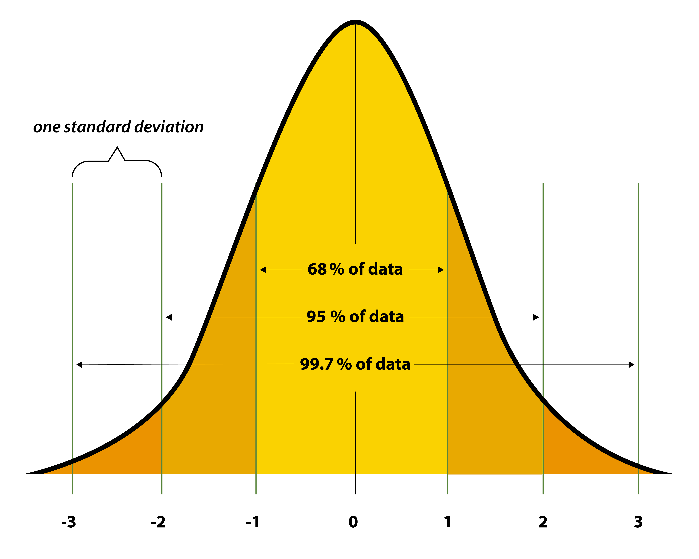

## The empirical rule: 68–95–99.7

Before we can talk about confidence intervals, it helps to revisit the **normal distribution** itself. A distribution is simply a representation of the results we see in a given situation — test scores, blood pressure readings, or (in our course) clinical attachment loss. When that distribution is *normal* (bell-shaped, symmetric around the mean), a remarkably simple pattern emerges, known as the **empirical rule**:

- About **68%** of values fall within **1 standard deviation (SD)** of the mean
- About **95%** fall within **2 SD**
- About **99.7%** fall within **3 SD**

{width="80%" fig-align="center"}

**Worked example:** Suppose a math class scores an average of 75% with a standard deviation of 5 points. By the empirical rule:

- 68% of students scored between **70% and 80%** (75 ± 1×5)
- 95% of students scored between **65% and 85%** (75 ± 2×5)
- 99.7% of students scored between **60% and 90%** (75 ± 3×5)

*(Adapted from the U.S. National Library of Medicine's [statistics course on Distribution](https://www.nlm.nih.gov/oet/ed/stats/02-800.html).)*

## From the empirical rule to a confidence interval

Confidence intervals are built on exactly this logic — they are also a **multiple of the standard deviation** placed around a central value. The difference is precision: the empirical rule uses convenient round numbers (1, 2, 3 SD) as a teaching heuristic, but a confidence interval needs the **exact** multiple that captures a chosen percentage of the distribution — not "about 95%", but *precisely* 95%.

Click the buttons below to see the exact SD-multiple (z-value) for a few common confidence levels:

```{python}
#| echo: false
import numpy as np
import plotly.graph_objects as go
from scipy.stats import norm

levels = [80, 90, 95, 99]
default_idx = 2  # 95%

x = np.linspace(-4, 4, 1000)
y = norm.pdf(x, 0, 1)

fig = go.Figure()

# Standard normal curve
fig.add_trace(go.Scatter(
    x=x, y=y,
    mode='lines',
    name='Standard Normal Distribution',
    line=dict(color='#003866', width=2),
    hovertemplate='SD: %{x:.2f}<br>Density: %{y:.3f}<extra></extra>'
))

n_levels = len(levels)
for i, level in enumerate(levels):
    z = norm.ppf(0.5 + level / 200)
    x_fill = x[(x >= -z) & (x <= z)]
    y_fill = norm.pdf(x_fill, 0, 1)
    x_fill = np.concatenate(([x_fill[0]], x_fill, [x_fill[-1]]))
    y_fill = np.concatenate(([0], y_fill, [0]))

    fig.add_trace(go.Scatter(
        x=x_fill, y=y_fill,
        fill='toself',
        mode='none',
        name=f'{level}% CI',
        fillcolor='rgba(122, 181, 29, 0.5)',
        hoverinfo='skip',
        visible=(i == default_idx)
    ))

    fig.add_trace(go.Scatter(
        x=[0], y=[max(y) * 0.4],
        mode='text',
        text=[f"<b>{level}% CI = ± {z:.2f} SD</b>"],
        textfont=dict(size=16, color="#003866"),
        name=f'{level}% label',
        hoverinfo='skip',
        visible=(i == default_idx)
    ))

buttons = []
for i, level in enumerate(levels):
    vis = [True]
    for j in range(n_levels):
        vis += [j == i, j == i]
    buttons.append(dict(
        args=[{"visible": vis}],
        label=f"{level}%",
        method="restyle"
    ))

fig.update_layout(
    title='How many standard deviations does a confidence interval span?',
    xaxis_title='Standard deviations (SD) from the mean',
    yaxis_title='Probability Density',
    template='plotly_white',
    showlegend=False,
    hovermode="x",
    margin=dict(l=40, r=40, t=60, b=40),
    xaxis=dict(range=[-4, 4]),
    updatemenus=[
        dict(
            type="buttons",
            direction="left",
            buttons=buttons,
            pad={"r": 10, "t": 10},
            showactive=True,
            x=1.0,
            xanchor="right",
            y=1,
            yanchor="top"
        ),
    ]
)

fig.show()
```

| Confidence level | ± SD (z-value) | Empirical rule rounds to |
|:---|:---|:---|
| 68% | 1.00 | 1 SD |
| 80% | 1.28 | — |
| 90% | 1.64 | — |
| 95% | 1.96 | ~2 SD |
| 99% | 2.58 | ~3 SD (99.7%) |

:::{.callout-tip title="Rule of thumb"}
This connects directly to the **68–95–99.7 rule** above: about 68% of values fall within 1 SD, about 95% within ~2 SD, and about 99.7% within 3 SD. A 95% confidence interval is *not exactly* ±2 SD, though — the precise value is ±1.96 SD. The empirical rule rounds for memorability; the confidence interval formula does not round at all.
:::

## A statistician's connection: SD vs. standard error

Here is the subtlety that separates the empirical rule from an actual confidence interval — and it is worth understanding, because it is easy to gloss over.

The empirical rule above describes the spread of **individual data points** around the mean, using the (population or sample) **standard deviation**. A confidence interval for a mean, however, is not describing where individual observations fall — it is describing how much a *sample mean* would bounce around if you repeated the study many times. That spread is the **standard error (SE)**:

$$SE = \frac{SD}{\sqrt{n}}$$

Because of the **Central Limit Theorem**, the sampling distribution of the mean is approximately normal — so the *same* z-multipliers from the table above still apply. A 95% confidence interval for a mean is:

$$\bar{x} \pm 1.96 \times SE$$

The reason confidence intervals shrink as sample size grows (while the raw-data spread described by the empirical rule does not) is exactly this ÷√n term: more data narrows our uncertainty about *where the mean is*, even though individual observations remain just as spread out as before. This is the key insight a statistician relies on when reading a confidence interval: it is not a statement about the data's variability, but about the *precision of the estimate*.

*(For the underlying formulas and normal-distribution properties, see the NLM's [Introduction to Statistics — Distribution](https://www.nlm.nih.gov/oet/ed/stats/02-800.html) course page.)*
