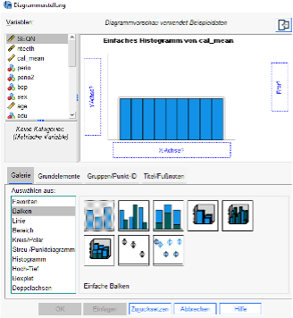
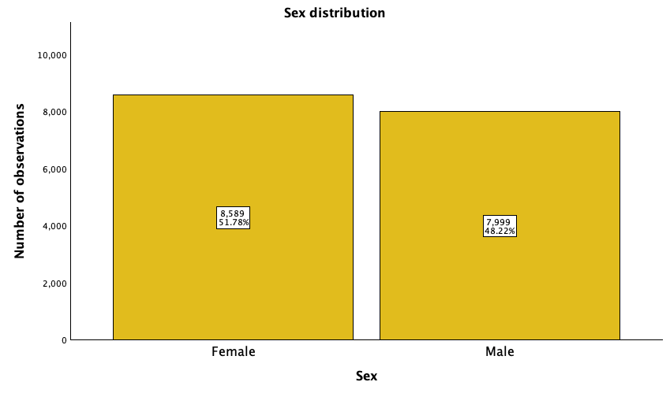
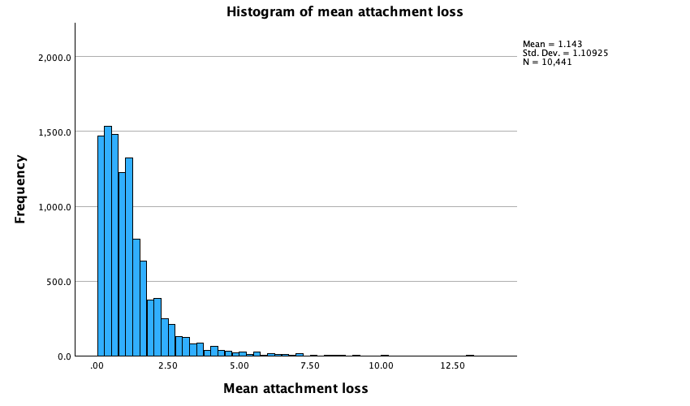
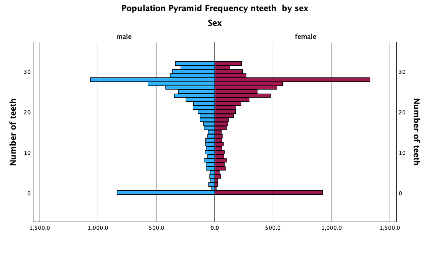

When working with a new dataset, you should first familiarize yourself with its variables and codings. Examples of this are given in **Tasks 1** and **2**. A graphical representation, as in the following exercises, can provide a substantive overview of the data.

## Task 1

What is the **level of measurement (scale type)** for `Gender/sex`, `Body Mass Index (BMI)`, and `BMI categories`?

First, answer this question based on your knowledge from the lecture, and then check whether the variables are correctly coded in SPSS.

To do this, switch from the **Data View** to the **Variable View**.⚙️

Task results

| **Variable**   | **SPSS measure** | **General type**      | **Values** |
|:---------------|:----------------------|:----------------------|:------|
| Gender         | Nominal               | Unordered categorical | Male, Female |
| BMI            | Scale                 | Continuous numeric    | Measured in kg/m² |
| BMI categories | Ordinal/Nominal in SPSS | Ordered categorical | < 18.5, 18.5-25, 25-30, $\geq$ 30 |

::: callout-tip
-   Use **nominal** for categories without a natural order.
-   Use **ordinal** for categories with a meaningful order.
-   Use **scale** when values can be meaningfully added, subtracted, or averaged.
:::

How does the level of measurement (scale level) of the variable `number of teeth` differ from that of body height or `BMI index`?

Task results

| **Variable** | **Nature** | **SPSS measure** | **Comment** |
|---------------|--------------------|---------------|-----------------------|
| BMI | Continuous numeric | Scale | Can take decimal values |
| Number of teeth | Discrete numeric | Scale | Only integer values, but still quantitative |

## Task 2

How can the following variables be appropriately **represented in a graph**?: `Gender`, `mean attachment loss`, `number of teeth`.

Decide, before entering the data, whether to use a bar chart, histogram, or boxplot.

💡 In SPSS:

  Grafik
  →
  Diagrammerstellung

Task results

::: {.result-figure-grid}
::: {.result-figure}

:::

::: {.result-figure}

:::

::: {.result-figure .wide}

:::
:::

::: callout-tip
Use a **bar chart** for categorical variables such as gender. Use **histograms** or **boxplots** for quantitative variables such as mean attachment loss or number of teeth.
:::

