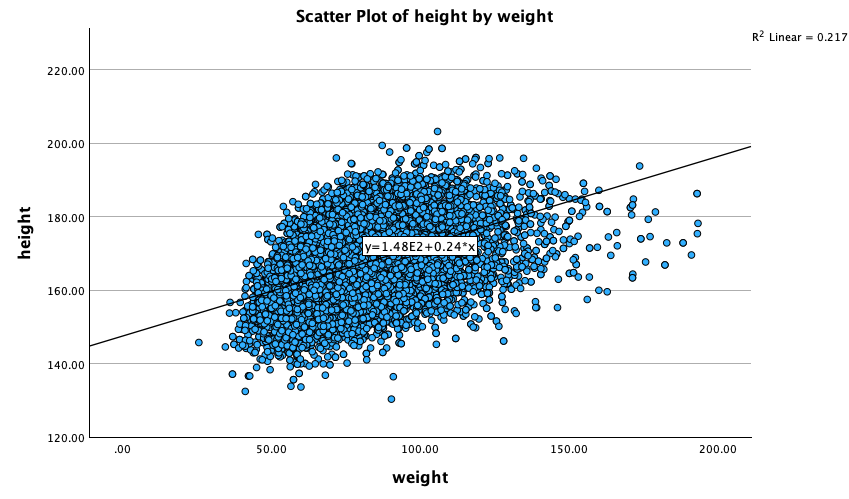

If you have measured several variables in your **cross-sectional** study, you can display an (⚠️ apparent) relationship between them using various methods.

## Task 3

Create a cross-table for diabetes (diab) and periodontitis (perio2).

💡 In SPSS:

  ANALYSIEREN
  →
  DESKRIPTIVE STATISTIKEN
  →
  KREUZTABELLEN

::: callout-tip
Which variable you assign to the rows or columns is up to you. However, it may be helpful to think of a consistent system — for example, “Outcome on top,” meaning the outcome variable is placed in the columns.
:::

Task results

*diab × perio2 Crosstabulation*

| diab         | perio2 = periodontitis | perio2 = no | **Total** |
|--------------|------------------------|-------------|-----------|
| **diabetes** | 199                    | 578         | **777**   |
| **no**       | 988                    | 6,290       | **7,278** |
| **Total**    | **1,187**              | **6,868**   | **8,055** | 

## Task 4

Calculate the **risk difference**, **relative risk**, and **odds ratio** for the association between diabetes and periodontitis.

💡 In SPSS:

  ANALYSIEREN
  →
  DESKRIPTIVE STATISTIKEN
  →
  KREUZTABELLEN

Then in the Crosstabs dialog, click **\[Cells...\]** and under **Percentages**, select **Row**, then click **Continue**.\
Next, click **\[Statistics...\]**, check **Risk**, and click **Continue**.

**Calculate manually:**

::: {.formula-grid}
::: {.formula-card}
**Risk difference (RD)**

Subtract the percentage values:
$$
RD = p_{\text{diabetic w/ perio}} - p_{\text{non-diabetic w/ perio}}
$$
:::

::: {.formula-card}
**Relative risk (RR)**

Divide the percentage values:
$$
RR = \frac{p_{\text{diabetic w/ perio}}}{p_{\text{non-diabetic w/ perio}}}
$$
:::
:::

::: {.formula-card .formula-card-wide}
**Odds ratio (OR)**

The odds ratio compares the odds of periodontitis between people with diabetes and people without diabetes.

::: {.odds-grid}
::: {.odds-step}
**Diabetic group**

$$
\text{Odds}_{\text{diabetic}} = \frac{a}{b}
$$
:::

::: {.odds-step}
**Non-diabetic group**

$$
\text{Odds}_{\text{non-diabetic}} = \frac{c}{d}
$$
:::
:::

::: {.odds-final}
**Final odds ratio**

$$
OR = \frac{a/b}{c/d} = \frac{a \times d}{b \times c}
$$
:::
:::

::: {.notation-card}
**Notation**

| Symbol | Meaning |
|:------:|:--------|
| $a$ | Diabetics **with** periodontitis |
| $b$ | Diabetics **without** periodontitis |
| $c$ | Non-diabetics **with** periodontitis |
| $d$ | Non-diabetics **without** periodontitis |
:::

Let the 2×2 table be:

|              | Periodontitis (+) | Periodontitis (−) |
|--------------|-------------------|-------------------|
| Diabetic     | ( a )             | ( b )             |
| Non-diabetic | ( c )             | ( d )             |

Task results

*diab × perio2 Crosstabulation*

| diab         |                | perio2 = periodontitis | perio2 = no | **Total** |
|--------------|--------------|-----------------|--------------|--------------|
| **diabetes** | Count          | 199                    | 578         | **777**   |
|              | \% within diab | 25.6%                  | 74.4%       | 100.0%    |
| **no**       | Count          | 988                    | 6,290       | **7,278** |
|              | \% within diab | 13.6%                  | 86.4%       | 100.0%    |
| **Total**    | Count          | **1,187**              | **6,868**   | **8,055** |
|              | \% within diab | 14.7%                  | 85.3%       | 100.0%    |

**Manual calculations**

::: {.metric-grid}
::: {.metric-card}
**Risk difference**

$$
RD = 25.6\% - 13.6\% = 12.0\%
$$

**Interpretation:** People with diabetes have a 12 percentage-point higher observed risk of periodontitis.
:::

::: {.metric-card}
**Relative risk**

$$
RR = \frac{25.6\%}{13.6\%} = 1.88
$$

**Interpretation:** Individuals with diabetes have 1.88 times the observed risk of periodontitis compared with those without diabetes.
:::

::: {.metric-card}
**Odds ratio**

$$
OR = \frac{199 \times 6290}{578 \times 988} = 2.19
$$

**Interpretation:** People with diabetes have 2.19 times higher observed odds of having periodontitis.
:::
:::

::: callout-warning
Because these are cross-sectional data, interpret the association descriptively. It may be an apparent association and does not prove causality.
:::

## Task 5

Create a scatterplot for the covariation of `weight` \~ `height`

💡 In SPSS: 

  GRAFIK
  →
  DIAGRAMMDARSTELLUNG
  →
  Streu/-Punktdiagramm auswählen

Draw a regression line.

💡 SPSS: Double-click on the created graph, then click the symbol marked below.

Task results

::: {.result-figure .wide}

:::

::: callout-tip
The points show a positive trend: taller participants tend to have higher weight. The regression line summarizes the average linear tendency.
:::

## Task 6

Calculate the covariance and the Pearson correlation coefficient for the relationship between `height` and `weight`.

💡 In SPSS: 

  ANALYSIEREN
  →
  KORRELATIONEN
  →
    BIVARIAT
  →
  Korrelationskoeffizienten: Pearson auswählen

Task results

Correlations

|                     |  weight  |  height  |
|---------------------|:--------:|:--------:|
| **weight**          |          |          |
| Pearson Correlation |    1     | .466\*\* |
| Sig. (2-tailed)     |          | \< .001  |
| N                   |  15,095  |  14,879  |
| **height**          |          |          |
| Pearson Correlation | .466\*\* |    1     |
| Sig. (2-tailed)     | \< .001  |          |
| N                   |  14,879  |  15,148  |

**Note:** \*\*.Correlation is significant at the 0.01 level (2-tailed)

**r** = 0.466 indicates a moderate positive linear correlation:

As height increases, weight tends to increase as well.

The p-value \< 0.001 shows this association is statistically significant.

## Additional task

Calculate the Spearman correlation coefficient for the relationship between `age` and `number of teeth`.

💡 In SPSS:

  ANALYSIEREN
  →
  KORRELATIONEN
  →
    BIVARIAT
  →
  Korrelationskoeffizienten: Spearman auswählen

Task results

Spearman's rho Correlations

|                         |    age    |  nteeth   |
|-------------------------|:---------:|:---------:|
| **age**                 |           |           |
| Correlation Coefficient |   1.000   | −.560\*\* |
| Sig. (2-tailed)         |     .     |  \< .001  |
| N                       |  16,588   |  14,394   |
| **nteeth**              |           |           |
| Correlation Coefficient | −.560\*\* |   1.000   |
| Sig. (2-tailed)         |  \< .001  |     .     |
| N                       |  14,394   |  14,394   |

**Note:** \*\*.Correlation is significant at the 0.01 level (2-tailed)

**ρ** = −0.560 indicates a significant, moderately strong negative monotonic association between age and number of teeth.

This means that, in general, as age increases, the number of teeth decreases.

# Notes

Strength of association

These are used as rule-of-thumb thresholds

| Absolute value of coefficient (r or ρ) | Strength of association | Interpretation |
|:-----------------------------:|:-------------------:|:--------------------|
| 0.00 – 0.19 | Very weak | Practically no linear/monotonic relationship |
| 0.20 – 0.39 | Weak | Slight relationship between variables |
| 0.40 – 0.59 | Moderate | Noticeable relationship, but not strong |
| 0.60 – 0.79 | Strong | Clear and substantial relationship |
| 0.80 – 1.00 | Very strong | Very tight, almost perfect relationship |

