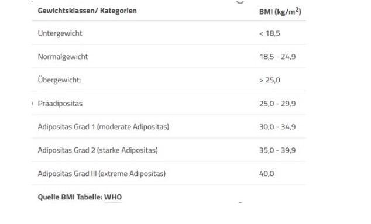
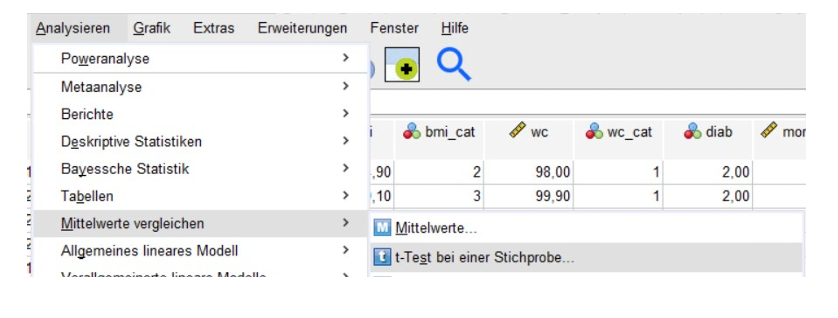
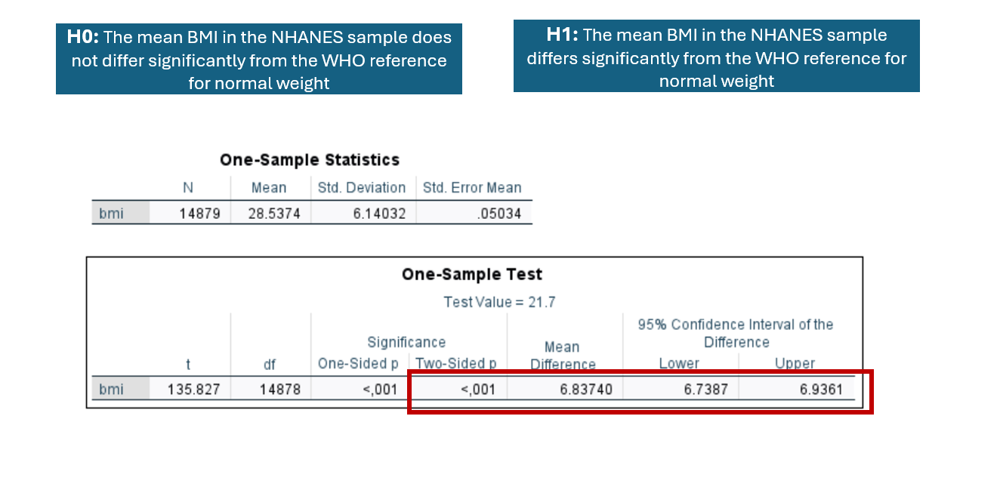
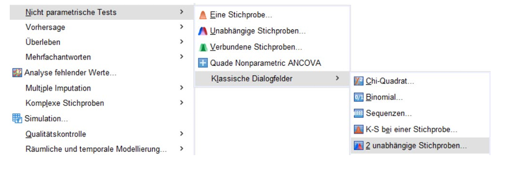
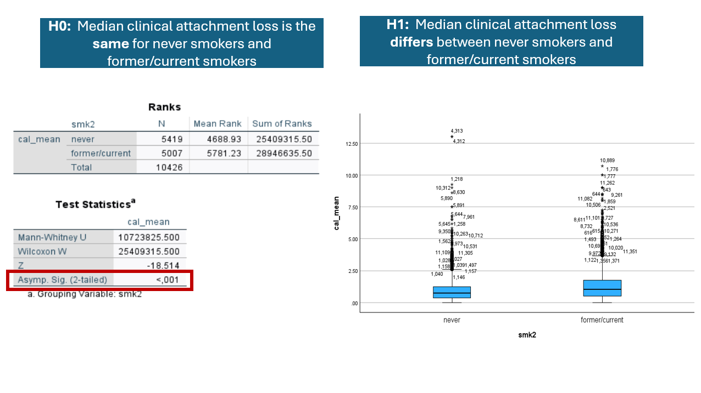
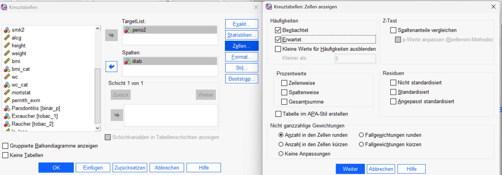
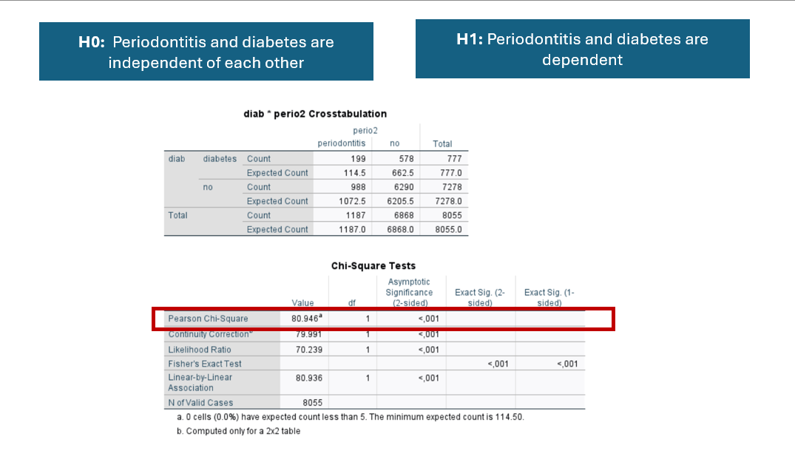

::: {.content-visible when-profile="english"}
# Practical 4
:::

::: {.content-visible when-profile="german"}
# Praktikum 4
:::

::: {.content-visible when-profile="english"}
Introduction: In this lesson, we will focus on **one-sample t-test**, **p-values**,**Mann Whitney U Test** and **Chi-square test**.

::: {.download-card}
[Download recap for Practical 4](recap/Practical4.pdf){download="recap_P4.pdf"}
:::

:::

::: {.content-visible when-profile="german"}
Einleitung: In dieser Stunde geht es um **t-Test für eine Stichprobe**, **p-Werte**, **U-Test von Mann und Whitney** und **Chi²-Vierfeldertest**.

::: {.download-card}
[Zusammenfassung aus Praktikum 4 herunterladen](recap/Practical4.pdf){download="recap_P4.pdf"}
:::

:::

:::: {.content-visible when-profile="english"}
### Exercise 1: One-sample t-test

The BMI expresses the relationship between body height and weight. According to the WHO, the following weight categories are defined based on the calculated value.

You want to test whether the mean BMI in the NHANES sample differs significantly from the WHO reference for normal weight.

For simplicity, use the mean normal weight BMI value of 21.7 as the comparison point.

**1.1 Exercise**

**Conduct a one-sample t-test**

💡 In SPSS

::: instruction-flow
Step 1: [ANALYSIEREN]{.step} [→]{.arrow} [Mittelwerte vergleichen]{.arrow} [→]{.arrow} [T-Test bei einer Stichprobe]{.arrow}
:::

Step 2: Set Test Value = 21.7 and Test Variable = `bmi`

Step 3: In the "Options" menu, set confidence interval to 95%.

Step 4: Uncheck "Estimate effect sizes'.

-   Two-sided p-value is less than 0.05.

-   The probability of observing a difference this large purely by random chance is less than 0.05.

-   It is very unlikely that the difference occurred by chance, and it provides strong evidence that there exists a true difference between the mean BMI in the NHANES sample and WHO reference for normal weight.

-   We reject the null hypothesis that there is no significant difference in mean BMI in the NHANES sample and WHO reference for normal weight.

**1.2 Comprehension question**

In your work, you report the confidence interval in addition to the p-value. Why?

Select all that apply (multiple answers possible):

a)  The p-value provides information about statistical significance. Reporting the confidence interval also allows the assessment of the direction and magnitude of the measured effect.

b)  The confidence interval should always be reported for a significant p-value. For non-significant p-values, the confidence interval usually provides no additional information.

c)  For a significant p-value, values above and below the confidence interval are excluded.

d)  Regardless of the width of the confidence interval, the point estimate based on the sample is the best approximation of the true population value.

e)  For a significant p-value and a confidence interval that does not include the "null effect," clinical relevance can automatically be assumed.

✓ `a) The p-value provides information about statistical significance. Reporting the confidence interval also allows the assessment of the direction and magnitude of the measured effect.`

✓ `d) Regardless of the width of the confidence interval, the point estimate based on the sample is the best approximation of the true population value.`

::::

:::: {.content-visible when-profile="german"}
### Aufgabe 1: t-Test bei einer Stichprobe

Der BMI setzt Körpergröße und Gewicht in ein Verhältnis. Die WHO unterscheidet je nach Höhe des errechneten Wertes folgende aufgeführte Gewichtsklassen

Sie möchten nun wissen, ob sich der durchschnittliche BMI in der NHANES-Gruppe statistisch vom Normalgewicht der WHO unterscheiden.

Zur einfacheren Berechnung legen Sie als „normal" den mittleren Wert des Normalgewichtes zugrunde (= 21.7)

**1.1 Aufgabe**

**Führen Sie einen t-Test bei einer Stichprobe durch**

💡SPSS:

::: instruction-flow
Step 1: [ANALYSIEREN]{.step} [→]{.arrow} [Mittelwerte vergleichen]{.arrow} [→]{.arrow} [T-Test bei einer Stichprobe]{.arrow}
:::

Testwert = 21.7; Testvariable = `bmi`; Optionen = Konfidenzintervall auf 95% festlegen. Entfernen Sie den Haken bei „Effektgrößen schätzen"

-   Two-sided p-value is less than 0.05.

-   The probability of observing a difference this large purely by random chance is less than 0.05.

-   It is very unlikely that the difference occurred by chance, and it provides strong evidence that there exists a true difference between the mean BMI in the NHANES sample and WHO reference for normal weight.

-   We reject the null hypothesis that there is no significant difference in mean BMI in the NHANES sample and WHO reference for normal weight.

**1.2 Verständnisfrage**

Sie geben in Ihrer Arbeit zusätzlich zum p-Wert auch noch das Konfidenzintervall an. Warum?

Kreuzen Sie zutreffende Antworten an (Mehrfachnennungen möglich):

a)  Der p-Wert gibt Aufschluss über die statistische Signifikanz. Durch Angabe des Konfidenzintervalls ist unter anderem die Interpretation der Richtung und Größe des gemessenen Effektes beurteilbar.

b)  Bei signifikantem p-Wert sollte das Konfidenzintervall immer berichtet werden. Bei nichtsignifikanten p-Werten liefert das Konfidenzintervall in der Regel keine weiteren Informationen.

c)  Bei signifikantem p-Wert sind Werte oberhalb und unterhalb des Konfidenzintervalls ausgeschlossen.

d)  Unabhängig von der Weite des Konfidenzintervalls, ist der Punktschätzer auf der Grundlage der Stichprobe die beste Annäherung an den wahren Wert der Grundgesamtheit.

e)  Bei signifikantem p-Wert und einem Konfidenzintervall, das den „Null -- Effekt" nicht miteinschließt, kann automatisch von klinischer Relevanz ausgegangen werden.

✓ `a) Der p-Wert gibt Aufschluss über die statistische Signifikanz. Durch Angabe des Konfidenzintervalls ist unter anderem die Interpretation der Richtung und Größe des gemessenen Effektes beurteilbar.`

✓ `d) Unabhängig von der Weite des Konfidenzintervalls, ist der Punktschätzer auf der Grundlage der Stichprobe die beste Annäherung an den wahren Wert der Grundgesamtheit.`

::::

:::: {.content-visible when-profile="english"}
### Exercise 2: Mann-Whitney-U Test

You aim to determine whether the mean attachment loss differs between non-smokers and smokers (former or current).

In Task 1, you examined the distribution of the variable `cal_mean` and found that it is not normally distributed.

For small sample sizes (e.g., n \< 25), you therefore decide either to transform the variable or to use the Mann--Whitney U test. The latter compares the medians of two groups.

**Conduct the Mann--Whitney U test.**

💡 In SPSS

::: instruction-flow
Step 1: [ANALYSIEREN]{.step} [→]{.arrow} [NICHTPARAMETRISCHE TESTS]{.arrow} [→]{.arrow} [KLASSISCHE DIALOGFELDER]{.arrow} [→]{.arrow} [2 unabhängige Stichproben]{.arrow}
:::

Step 2: Select `cal_mean` as Test variable

Step 3: Select `smk2` as the Grouping variable (Note: Note: Here, you need to define the groups as "Group 1: 1" and "Group 2: 2.")

Step 4: Select Mann-Whitney-U-Test.

Based on the "Asymp. Sig. (2-tailed)" value in the output, determine whether to retain or reject the null hypothesis.

-   Asymp. Sig. (2-tailed) value is less than 0.05.

-   The probability of observing a difference this large purely by random chance is less than 0.05.

-   It is very unlikely that the difference occurred by chance, and it provides strong evidence that there exists a true difference between the median CAL between never smokers and former/current smokers.

-   We reject the null hypothesis that the median clinical attachment loss is the same for never smokers and former/current smokers

::::

:::: {.content-visible when-profile="german"}
### Aufgabe 2: Mann-Whitney-U Test

Sie möchten wissen, ob sich der durchschnittliche Attachmentverlust von Nichtrauchern zu Rauchern (former/current) unterscheidet.

Sie haben in Aufgabe 1 die Verteilung der Variable `cal_mean` untersucht und festgestellt, dass keine Normalverteilung vorliegt. Bei kleinen Stichproben (n \< 25 z.B.) entscheiden Sie Sich daher für eine Transformation der Variable oder den Mann-Whitney-U Test. Letzterer vergleicht zwei Mediane miteinander.

**Führen Sie den Mann-Whitney-U Test durch.**

💡 SPSS:

::: instruction-flow
Step 1: [ANALYSIEREN]{.step} [→]{.arrow} [NICHTPARAMETRISCHE TESTS]{.arrow} [→]{.arrow} [KLASSISCHE DIALOGFELDER]{.arrow} [→]{.arrow} [2 unabhängige Stichproben]{.arrow}
:::

Testvariable: `cal_mean`

Gruppierungsvariable: `smk2` (Hinweis: Hier müssen Sie die Gruppen definieren „Gruppe 1: 1" und „Gruppe 2: 2")

Wählen Sie den Mann-Whitney-U-Test aus.

Interpretieren Sie anhand der Ausgabe „Asymp. Sig. (2-seitig)" ob Sie die Nullhypothese beibehalten oder verwerfen müssen.

-   Asymp. Sig. (2-tailed) value is less than 0.05.

-   The probability of observing a difference this large purely by random chance is less than 0.05.

-   It is very unlikely that the difference occurred by chance, and it provides strong evidence that there exists a true difference between the median CAL between never smokers and former/current smokers.

-   We reject the null hypothesis that the median clinical attachment loss is the same for never smokers and former/current smokers

::::

:::: {.content-visible when-profile="english"}
### Exercise 3: Frequency tests

The Chi-square (χ²) four-field test is used, in its simplest form, to examine the independence of two binary (yes/no) variables. (It is therefore sometimes also referred to as the Chi-square test of independence.)

In epidemiology, this test is applicable to numerous research questions, such as: "Is there an association between the presence of periodontitis (yes/no) and diabetes (yes/no)?"

Under the null hypothesis, the relevant outcomes are independent of each other, whereas the alternative hypothesis states that a dependency exists.

**Conduct a Chi-square (χ²) test to address the question stated above.**

💡 In SPSS

::: instruction-flow
Step 1: [ANALYSIEREN]{.step} [→]{.arrow} [DESKRIPTIVE STATISTIK]{.arrow} [→]{.arrow} [KREUZTABELLEN]{.arrow}
:::

Step 2: Select `perio2` as outcome and `diab` as Target variable.

Step 3: Under "Statistics" select "CHI²-Test".

Step 3: In the "Cells" options for Frequencies, select "Observed" and "Expected".

-   The p-value is less than 0.05.

-   We reject the null hypothesis of independence between diabetes and periodontitis.

::::

:::: {.content-visible when-profile="german"}
### Aufgabe 3: Tests für Häufigkeiten

Der CHI² - Vierfeldertest dient im einfachsten Fall dazu, die Unabhängigkeit zweier Alternativmerkmale (binär) zu untersuchen. (Daher manchmal auch CHI²-Unabhängigkeitstest genannt). Hierfür gibt es in der Epidemiologie zahlreiche Fragestellungen, wie etwa: „Gibt es einen Zusammenhang zwischen dem Vorliegen einer Parodontitis (ja/nein) und Diabetes (ja/nein)?".

Unter der Nullhypothese sind die relevanten Ergebnisse unabhängig voneinander, die Alternativhypothese besagt dagegen, dass eine Abhängigkeit besteht.

**Führen Sie einen CHI² Test für die oben genannte Fragestellung durch.**

💡 SPSS:

::: instruction-flow
Step 1: [ANALYSIEREN]{.step} [→]{.arrow} [DESKRIPTIVE STATISTIK]{.arrow} [→]{.arrow} [KREUZTABELLEN]{.arrow}
:::

Exposition „diab" in die Zeilen, Outcome „perio2" in die Spalten. Unter Statistiken den "CHI²-Test" ankreuzen. Unter Zellen bei Häufigkeiten „Beobachtet" und „Erwartet" auswählen.

-   The p-value is less than 0.05.

-   We reject the null hypothesis of independence between diabetes and periodontitis.

::::