::: {.content-visible when-profile="english"}
# Practical 6: Logistic Regression

::: {.grid}

::: {.g-col-12 .g-col-md-6}
::: {.feature-card}
### Outcome Variable
*Also known as: response, predicted, dependent variable*

-   **Type:** Binary
-   1 variable
:::
:::

::: {.g-col-12 .g-col-md-6}
::: {.feature-card}
### Influencing factor(s)
*Also known as: covariate, independent, explanatory, predictor variable*

-   **Type:** Continuous or Categorical
-   One (Univariable) or Multiple (Multivariable)
:::
:::

::: {.g-col-12}
::: {.feature-card}

### Practicum Scenario
In this practical, we use **binary logistic regression** to study the association between:

-   **Covariates:** BMI (`bmi`), age (`age`), and dummy-coded smoking variables (`Former`, `Current`)
-   **Outcome:** Periodontitis (`perio_binary`)
    -   *Values:* 0 = No, 1 = Yes
:::
:::

:::

::: {.download-card}
[Download recap for Practical 6](recap/Practical6.pdf){download="recap_P6.pdf"}
:::

:::

::: {.content-visible when-profile="german"}
# Praktikum 6: Logistische Regression

::: {.grid}

::: {.g-col-12 .g-col-md-6}
::: {.feature-card}
### Abhängige Variable
*Auch bekannt als: Zielvariable, Outcome*

-   **Typ:** Binär
-   1 Variable
:::
:::

::: {.g-col-12 .g-col-md-6}
::: {.feature-card}
### Einflussfaktor(en)
*Auch bekannt als: Kovariate, unabhängige, erklärende Variable, Prädiktor*

-   **Typ:** Stetig oder kategorial
-   Eine (Univariabel) oder mehrere (Multivariabel)
:::
:::

::: {.g-col-12}
::: {.feature-card}

### Praktikumsszenario
In diesem Praktikum untersuchen wir mit der **binär logistischen Regression** den Zusammenhang zwischen:

-   **Kovariaten:** BMI (`bmi`), Alter (`age`) und dummy-kodierten Rauchen-Variablen (`Former`, `Current`)
-   **Outcome:** Parodontitis (`perio_binary`)
    -   *Werte:* 0 = Nein, 1 = Ja
:::
:::

:::

::: {.download-card}
[Zusammenfassung aus Praktikum 6 herunterladen](recap/Practical6.pdf){download="recap_P6.pdf"}
:::

:::

:::: {.content-visible when-profile="english"}
## Data Preparation: Creating `perio_binary`

The binary outcome used throughout this practical is derived from the variable `perio` (Periodontitis, CDC–AAP definition), which has **four levels**: 1 = None, 2 = Mild, 3 = Moderate, 4 = Severe.

To use periodontitis as the outcome of a **binary** logistic regression, we collapse `perio` into two categories: no periodontitis vs. any periodontitis (mild, moderate, or severe).

SPSS steps

💡 SPSS:

  Transform
  →
  Recode into Different Variables

Step 2:  Select `perio` >> enter `perio_binary` under Name and "Periodontitis" under Label >> press **Change**.

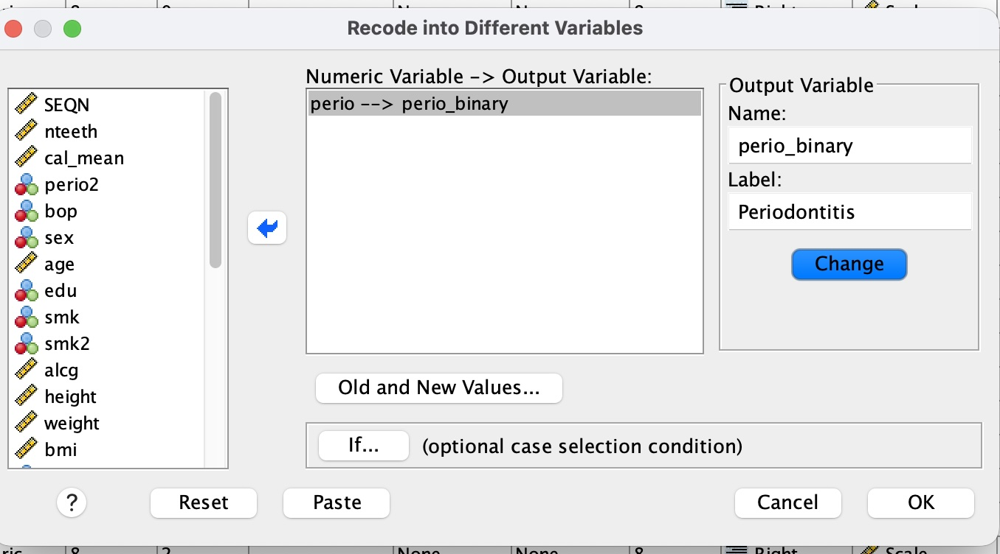{width="60%" fig-align="center"}

Step 3:  Click **"Old and New Values..."**.

Step 4:  Configure the values:

-   Under **Old Value**: enter `1` >> Under **New Value**: enter `0` >> press **Add**.
-   Under **Old Value**: select **Range**, enter `2` through `4` >> Under **New Value**: enter `1` >> press **Add**.
-   Under **Old Value**: select **All other values** >> Under **New Value**: select **Copy old value(s)** >> press **Add**. (This handles missing values)
-   Press **Continue**, then **OK**.

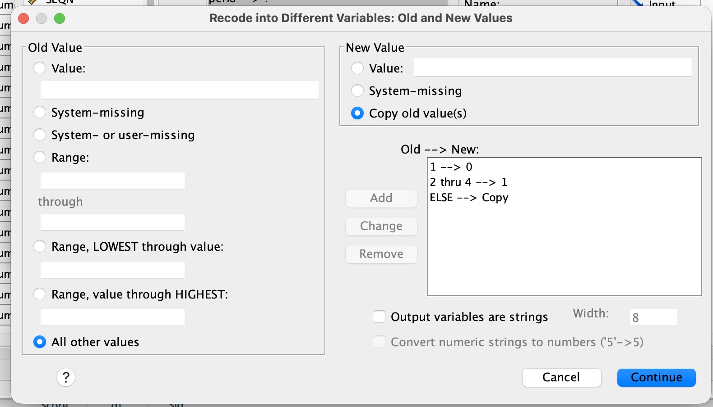{width="60%" fig-align="center"}

**Note:** Ensure `Measure` is Nominal in Variable View, Decimals is set to 0, and set Values to 0 = "No periodontitis" and 1 = "Periodontitis".

This gives the binary dependent variable `perio_binary` used in the exercises below (0 = No, 1 = Yes).

## Exercise 1: Univariable and Multivariable Logistic Regression

### Exercise 1.1 Regression with only `bmi` as independent variable

Run a logistic regression with only `bmi` as the independent variable.

💡 SPSS:

  Analyze
  →
  Regression
  →
  Binary Logistic

Step 2:  Dependent Variable: `perio_binary`.

Step 3:  Covariates: `bmi`.

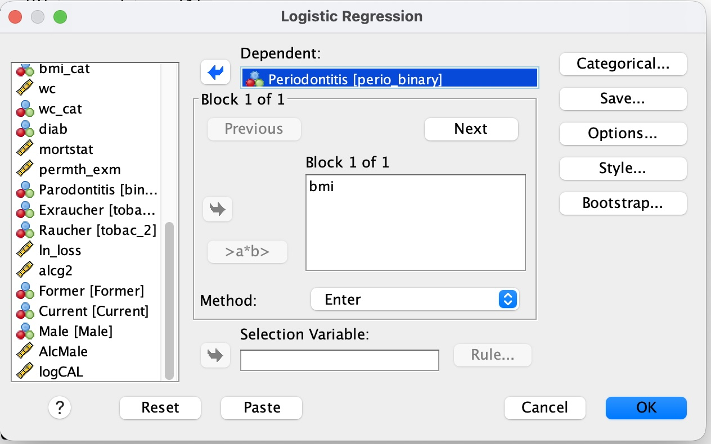{width="55%" fig-align="center"}

Task results

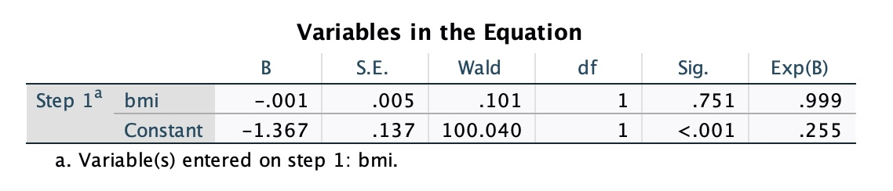{width="70%" fig-align="center"}

| Variable | Coefficient B | Sig. | Exp(B) |
|---|---|---|---|
| bmi | −0.001 | 0.751 | 0.999 |
| Constant | −1.367 | <0.001 | 0.255 |

**Interpretation:**

-   The coefficient for `bmi` is essentially zero (B = −0.001), and the effect is **not statistically significant** (p = 0.751) — with only `bmi` in the model, BMI shows no association with periodontitis.
-   Exp(B) = 0.999 means that each 1-unit increase in BMI is associated with a 0.1% decrease in the odds of periodontitis — a negligible effect, consistent with the non-significant p-value.
-   The constant's Exp(B) = 0.255 represents the baseline odds of periodontitis when `bmi` = 0; it is not clinically meaningful on its own (a BMI of 0 does not occur), but it is needed to define the model equation.

### Exercise 1.2 Interpret the SPSS output

> 💡 **Hint:** If you need help, you can find the solution in the cheatsheet at the bottom of this page.

### Exercise 1.3 Regression with several independent variables

Add the variables `age`, `bmi`, and your dummy-coded smoking variables as independent variables.

**Note:** If you completed Practical 5, you already have the dummy variables for smoking status. Here they are named `Former` and `Current`.

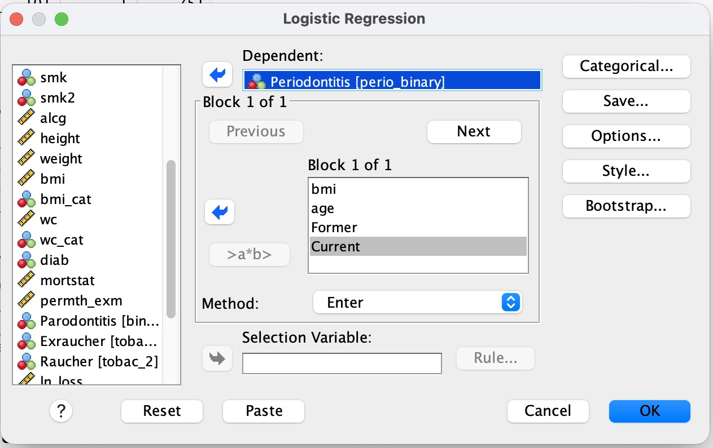{width="55%" fig-align="center"}

Task results

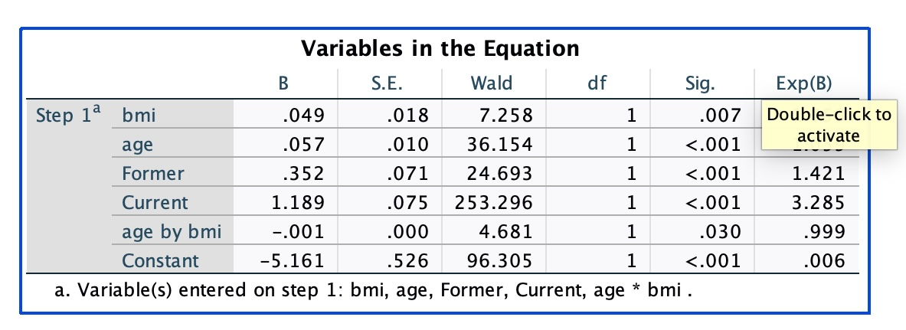{width="70%" fig-align="center"}

| Variable | Coefficient B | Sig. | Exp(B) |
|---|---|---|---|
| bmi | 0.049 | 0.007 | 1.050 |
| age | 0.057 | <0.001 | 1.059 |
| Former | 0.352 | <0.001 | 1.421 |
| Current | 1.189 | <0.001 | 3.285 |
| age × bmi | −0.001 | 0.030 | 0.999 |
| Constant | −5.161 | <0.001 | 0.006 |

**Note:** This output already includes the `age × bmi` interaction term — you'll build it explicitly in Exercise 3, where it is interpreted in detail.

:::{.callout-tip title="Why does bmi change?"}
In Exercise 1.1, `bmi` alone was **not** significantly associated with periodontitis (p = 0.751, Exp(B) ≈ 1). In the multivariable model above, `bmi` becomes statistically significant (p = 0.007). This happens because `age` and `bmi` are correlated with each other and both affect periodontitis risk — adjusting for `age` removes some of that confounding and reveals the effect of `bmi` more clearly.
:::

## Exercise 2: Model Comparison

Using what you learned in Exercise 1.1, compare whether your new model:

1.  Is better than the "null model"
2.  Describes the probability of periodontitis better than your model with only the variable `bmi`

:::{.callout-tip title="How to compare"}
Look at the **Omnibus Test of Model Coefficients** (Chi², df, Sig.) and the **pseudo R² values** (Cox & Snell, Nagelkerke) of each model — see the cheatsheet below for how to read these.
:::

Task results

[Full SPSS output (PDF)](output_uni_multivariable.pdf){target="_blank"}

| Model | Omnibus χ² (vs. null) | df | Sig. | −2 Log likelihood | Cox & Snell R² | Nagelkerke R² |
|---|---|---|---|---|---|---|
| `bmi` only (Exercise 1.1) | 0.101 | 1 | 0.751 | 7784.274 | 0.000 | 0.000 |
| `bmi` + `age` + `Former` + `Current` (Exercise 1.3) | 509.947 | 4 | <0.001 | 7258.779 | 0.063 | 0.100 |

**1. Is the new model better than the "null model"?**

Yes. The Omnibus Test for the multivariable model is highly significant (χ²(4) = 509.947, p < .001) — adding `bmi`, `age`, `Former`, and `Current` explains periodontitis status significantly better than the null model (intercept only). The univariable `bmi`-only model, by contrast, was **not** significantly better than the null model (χ²(1) = 0.101, p = .751) — `bmi` alone adds essentially nothing.

**2. Does it describe the probability of periodontitis better than the model with only `bmi`?**

Yes, clearly. Since the `bmi`-only model is nested inside the multivariable model, we can compare them with a likelihood-ratio test: the difference in −2 Log likelihood is 7784.274 − 7258.779 = 525.495, with 4 − 1 = 3 additional degrees of freedom (`age`, `Former`, `Current`). This is far larger than the critical χ² value for df = 3 (7.815 at α = .05), so the multivariable model fits significantly better. This also shows in the pseudo-R²: Nagelkerke R² rises from .000 (`bmi` only) to .100 (multivariable) — the model explains much more of the variation in periodontitis once `age` and smoking status are added.

**Note:** The two models are estimated on slightly different sample sizes (7858 vs. 7848 cases) due to missing values on `age`/smoking — a minor caveat for the likelihood-ratio comparison, but it does not change the conclusion given how large the difference is.

## Exercise 3: Regression with an Interaction Term

Run the regression with an additional interaction term.

To add an interaction term, click `age`, hold down the **CTRL key**, and also click `bmi`. Then click the **">a\*b>"** icon.

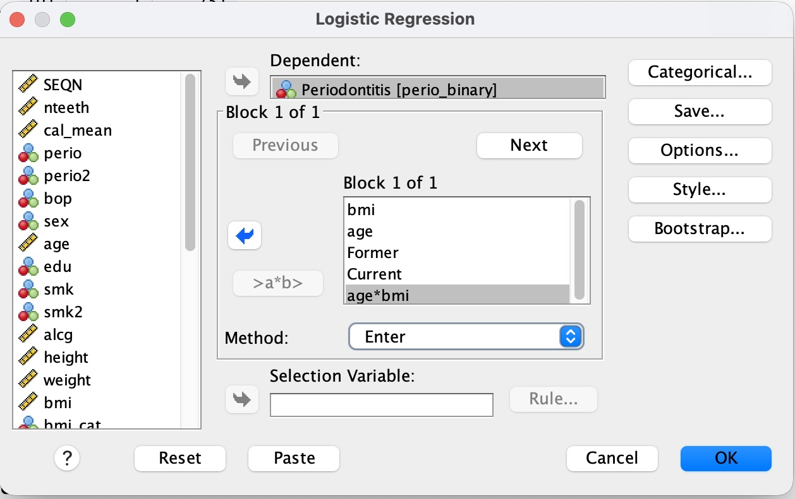{width="55%" fig-align="center"}

Task results

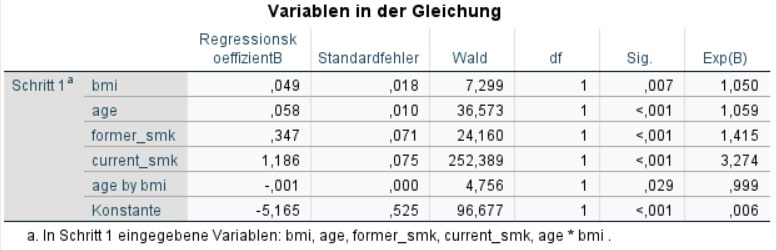{width="70%" fig-align="center"}

| Variable | Coefficient B | Sig. | Exp(B) |
|---|---|---|---|
| bmi | 0.049 | 0.007 | 1.050 |
| age | 0.058 | <0.001 | 1.059 |
| former_smk | 0.347 | <0.001 | 1.415 |
| current_smk | 1.186 | <0.001 | 3.274 |
| age × bmi | −0.001 | 0.029 | 0.999 |
| Constant | −5.165 | <0.001 | 0.006 |

**Questions:**

a) Would you classify the effect as tiny?

b) In which direction does the effect modification act (in other words: does the overweight of an older patient affect the odds of periodontitis the same way as a higher BMI of a young patient)?

Task results

a) The interaction term `age × bmi` is statistically significant (p = 0.029), but its Exp(B) is 0.999 — extremely close to 1. So the *size* of the effect modification is tiny, even though it is statistically detectable (which is common with large samples).

b) The coefficient is negative (B = −0.001), meaning the effect of `bmi` on the odds of periodontitis becomes slightly *weaker* as `age` increases. So no — the same increase in BMI is associated with a somewhat larger increase in the odds of periodontitis in a young patient than in an older patient. Age slightly attenuates the effect of BMI.

::::

:::: {.content-visible when-profile="german"}
## Datenaufbereitung: Erstellen von `perio_binary`

Die binäre Zielvariable, die in diesem Praktikum durchgängig verwendet wird, wird aus der Variable `perio` (Parodontitis, CDC–AAP Definition) abgeleitet, die **vier Ausprägungen** hat: 1 = None, 2 = Mild, 3 = Moderate, 4 = Severe.

Um Parodontitis als Outcome einer **binär logistischen** Regression zu verwenden, fassen wir `perio` zu zwei Kategorien zusammen: keine Parodontitis vs. Parodontitis (mild, moderate oder severe).

SPSS-Schritte

💡 SPSS:

  Transformieren
  →
  Umkodieren in andere Variablen

Schritt 2:  Wählen Sie `perio` aus >> geben Sie unter Name `perio_binary` und unter Label „Periodontitis" ein >> klicken Sie auf **Ändern**.

{width="60%" fig-align="center"}

Schritt 3:  Klicken Sie auf **„Alte und neue Werte..."**.

Schritt 4:  Konfigurieren Sie die Werte:

-   Unter **Alter Wert**: geben Sie `1` ein >> Unter **Neuer Wert**: geben Sie `0` ein >> klicken Sie auf **Hinzufügen**.
-   Unter **Alter Wert**: wählen Sie **Bereich**, geben Sie `2` bis `4` ein >> Unter **Neuer Wert**: geben Sie `1` ein >> klicken Sie auf **Hinzufügen**.
-   Unter **Alter Wert**: wählen Sie **Alle anderen Werte** >> Unter **Neuer Wert**: wählen Sie **Werte kopieren** >> klicken Sie auf **Hinzufügen**. (Damit werden fehlende Werte behandelt)
-   Klicken Sie auf **Weiter**, dann auf **OK**.

{width="60%" fig-align="center"}

**Hinweis:** Stellen Sie sicher, dass `Messniveau` in der Variablenansicht auf Nominal gesetzt ist, Dezimalstellen auf 0 steht, und setzen Sie die Werte 0 = „Keine Parodontitis" und 1 = „Parodontitis".

Damit erhalten Sie die binäre abhängige Variable `perio_binary`, die in den folgenden Aufgaben verwendet wird (0 = Nein, 1 = Ja).

## Aufgabe 1 – Durchführen einer binär-logistischen Regression für „perio_binary" als Outcome

### Aufgabe 1.1 – Regression mit nur „bmi" als unabhängiger Variable

Führen Sie zunächst eine Regression mit nur „bmi" als unabhängiger Variable durch.

💡 SPSS:

  Analysieren
  →
  Regression
  →
  Binär Logistisch

Schritt 2:  Abhängige Variable: `perio_binary`.

Schritt 3:  Kovariaten: `bmi`.

{width="55%" fig-align="center"}

Ergebnisse der Aufgabe

{width="70%" fig-align="center"}

| Variable | Regressionskoeffizient B | Sig. | Exp(B) |
|---|---|---|---|
| bmi | −0,001 | 0,751 | 0,999 |
| Konstante | −1,367 | <0,001 | 0,255 |

**Interpretation:**

-   Der Koeffizient für `bmi` liegt praktisch bei null (B = −0,001), und der Effekt ist **nicht statistisch signifikant** (p = 0,751) – solange nur `bmi` im Modell ist, zeigt der BMI keine Assoziation mit Parodontitis.
-   Exp(B) = 0,999 bedeutet, dass ein Anstieg des BMI um 1 Einheit mit einem Rückgang der Odds für Parodontitis um 0,1 % verbunden ist – ein vernachlässigbarer Effekt, was zum nicht signifikanten p-Wert passt.
-   Das Exp(B) der Konstante (0,255) entspricht den Odds für Parodontitis, wenn `bmi` = 0 wäre; dieser Wert ist für sich genommen klinisch nicht sinnvoll interpretierbar (ein BMI von 0 kommt nicht vor), wird aber zur Definition der Modellgleichung benötigt.

### Aufgabe 1.2 – Interpretieren Sie den SPSS-Output

> 💡 **Hinweis:** Sollten Sie Hilfe benötigen, finden Sie die Lösung dazu im Cheatsheet am Ende dieser Seite.

### Aufgabe 1.3 – Regression mit mehreren unabhängigen Variablen

Fügen Sie die Variablen „age", „bmi" und Ihre dummycodierten Variablen für Rauchen als unabhängige Variablen hinzu.

**Hinweis:** Wenn Sie Praktikum 5 bereits bearbeitet haben, besitzen Sie die dummykodierten Variablen für den Rauchstatus schon. Hier heißen sie `Former` und `Current`.

{width="55%" fig-align="center"}

Ergebnisse der Aufgabe

{width="70%" fig-align="center"}

| Variable | Regressionskoeffizient B | Sig. | Exp(B) |
|---|---|---|---|
| bmi | 0,049 | 0,007 | 1,050 |
| age | 0,057 | <0,001 | 1,059 |
| Former | 0,352 | <0,001 | 1,421 |
| Current | 1,189 | <0,001 | 3,285 |
| age × bmi | −0,001 | 0,030 | 0,999 |
| Konstante | −5,161 | <0,001 | 0,006 |

**Hinweis:** Diese Ausgabe enthält bereits den Interaktionsterm `age × bmi` – Sie erstellen ihn explizit in Aufgabe 3, wo er auch ausführlich interpretiert wird.

:::{.callout-tip title="Warum verändert sich bmi?"}
In Aufgabe 1.1 war `bmi` allein **nicht** signifikant mit Parodontitis assoziiert (p = 0,751, Exp(B) ≈ 1). Im multivariablen Modell oben wird `bmi` statistisch signifikant (p = 0,007). Der Grund: `age` und `bmi` sind miteinander korreliert und beeinflussen beide das Parodontitis-Risiko – die Adjustierung für `age` entfernt einen Teil dieses Confoundings und macht den Effekt von `bmi` deutlicher sichtbar.
:::

## Aufgabe 2 – Modellvergleich

Vergleichen Sie nun mit dem Wissen aus Aufgabe 1.1, ob ihr neues Modell:

1.  Besser ist als das „Nullmodell"
2.  Die Wahrscheinlichkeit für eine Parodontitis besser beschreibt als Ihr Modell mit der einzigen Variable „bmi"

:::{.callout-tip title="So vergleichen Sie"}
Betrachten Sie den **Omnibus-Test der Modellkoeffizienten** (Chi-Quadrat, df, Sig.) und die **Pseudo-R²-Werte** (Cox & Snell, Nagelkerke) der jeweiligen Modelle – wie diese zu lesen sind, erklärt das Cheatsheet weiter unten.
:::

Ergebnisse der Aufgabe

[Vollständige SPSS-Ausgabe (PDF)](output_uni_multivariable.pdf){target="_blank"}

| Modell | Omnibus χ² (vs. Nullmodell) | df | Sig. | −2 Log-Likelihood | Cox & Snell R² | Nagelkerke R² |
|---|---|---|---|---|---|---|
| nur `bmi` (Aufgabe 1.1) | 0,101 | 1 | 0,751 | 7784,274 | 0,000 | 0,000 |
| `bmi` + `age` + `Former` + `Current` (Aufgabe 1.3) | 509,947 | 4 | <0,001 | 7258,779 | 0,063 | 0,100 |

**1. Ist das neue Modell besser als das „Nullmodell"?**

Ja. Der Omnibus-Test für das multivariable Modell ist hoch signifikant (χ²(4) = 509,947, p < ,001) – die Hinzunahme von `bmi`, `age`, `Former` und `Current` erklärt den Parodontitis-Status deutlich besser als das Nullmodell (nur Konstante). Das univariable Modell mit nur „bmi" war dagegen **nicht** signifikant besser als das Nullmodell (χ²(1) = 0,101, p = ,751) – „bmi" allein bringt praktisch nichts.

**2. Beschreibt es die Wahrscheinlichkeit für eine Parodontitis besser als das Modell mit nur „bmi"?**

Ja, eindeutig. Da das „bmi"-Modell im multivariablen Modell geschachtelt ist, können wir beide mit einem Likelihood-Quotienten-Test vergleichen: Die Differenz der −2 Log-Likelihood beträgt 7784,274 − 7258,779 = 525,495, bei 4 − 1 = 3 zusätzlichen Freiheitsgraden (`age`, `Former`, `Current`). Das liegt weit über dem kritischen χ²-Wert für df = 3 (7,815 bei α = ,05), das multivariable Modell passt also signifikant besser. Das zeigt sich auch am Pseudo-R²: Das Nagelkerke R² steigt von ,000 (nur „bmi") auf ,100 (multivariabel) – das Modell erklärt deutlich mehr der Variation in der Parodontitis, sobald „age" und Rauchstatus hinzukommen.

**Hinweis:** Die beiden Modelle werden auf leicht unterschiedlichen Stichprobengrößen geschätzt (7858 vs. 7848 Fälle) aufgrund fehlender Werte bei „age"/Rauchstatus – ein kleiner Vorbehalt für den Likelihood-Quotienten-Vergleich, der angesichts der Größe des Unterschieds die Schlussfolgerung aber nicht ändert.

## Aufgabe 3 – Regression mit Interaktionsterm

Führen Sie die Regression mit einem zusätzlichen Interaktionsterm durch.

Um einen Interaktionsterm einzufügen, klicken Sie „age", halten dabei die **STRG-Taste** gedrückt und drücken dann auf „bmi". Klicken Sie dann auf das Symbol **„>a\*b>"**.

{width="55%" fig-align="center"}

Ergebnisse der Aufgabe

{width="70%" fig-align="center"}

| Variable | Regressionskoeffizient B | Sig. | Exp(B) |
|---|---|---|---|
| bmi | 0,049 | 0,007 | 1,050 |
| age | 0,058 | <0,001 | 1,059 |
| former_smk | 0,347 | <0,001 | 1,415 |
| current_smk | 1,186 | <0,001 | 3,274 |
| age × bmi | −0,001 | 0,029 | 0,999 |
| Konstante | −5,165 | <0,001 | 0,006 |

**Fragen:**

a) Würden Sie den Effekt als winzig einstufen?

b) In welche Richtung wirkt die Effektmodifikation (oder anders: Wirkt das Übergewicht eines älteren Patienten genauso wie ein höherer bmi eines jungen Patienten?)

Ergebnisse der Aufgabe

a) Der Interaktionsterm `age × bmi` ist statistisch signifikant (p = 0,029), sein Exp(B) liegt mit 0,999 aber extrem nahe an 1. Die *Größe* der Effektmodifikation ist also winzig, auch wenn sie statistisch nachweisbar ist (was bei großen Stichproben häufig vorkommt).

b) Der Koeffizient ist negativ (B = −0,001), das heißt der Effekt von `bmi` auf die Odds für Parodontitis wird mit steigendem `age` etwas *schwächer*. Das Übergewicht eines älteren Patienten wirkt sich also nicht genauso aus wie ein höherer BMI eines jungen Patienten: Der gleiche BMI-Anstieg ist bei einem jungen Patienten mit einem etwas größeren Anstieg der Odds für Parodontitis verbunden als bei einem älteren Patienten. Das Alter schwächt den Effekt des BMI leicht ab.

::::

:::: {.content-visible when-profile="english"}
## Cheatsheet – Logistic Regression

Show cheatsheet

### Introduction

**(Binary) logistic regression** is used when we want to study the relationship between a binary dependent variable and one or more independent variables.

Unlike linear regression, the dependent variable here is **binary** (heart attack: yes or no, tooth present: yes or no). The independent variables, on the other hand, are at least interval-scaled or coded as dummy variables.

Binary logistic regression analyzes the relationship between the **probability** that the dependent variable takes the value 1 and the independent variables. So the model does not predict the value of the dependent variable directly, but rather the **probability** that it takes the value 1.

### Assumptions

The assumptions are less restrictive than for linear regression:

-   The dependent variable is binary (coded 0 / 1)
-   The independent variables are metric or, for categorical variables, coded as dummy variables
-   The groups of categorical predictors are sufficiently large
-   The independent variables are not highly correlated with each other (multicollinearity)

Unlike linear regression, the method used is not "least-squares" but the **"maximum likelihood"** method.

### Visualization (S-curve)

Highly simplified illustration (blue = observed 1, red = observed 0):

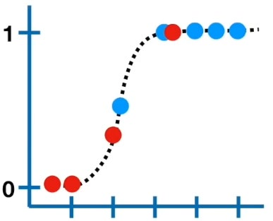{width="45%" fig-align="center"}

We use the observed values to compute the predicted probabilities of our S-curve. Blue (= 1) should be predicted by our model with as high a probability as possible. Our model predicts the probability of 1; the probability of red (= not 1) is accordingly (1 − probability of blue). Here too, the model should predict as precisely as possible whether 1 does *not* occur. The maximum likelihood is computed from the individual probabilities:

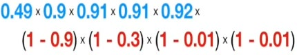{width="60%" fig-align="center"}

SPSS runs these calculations repeatedly using an algorithm and chooses the S-curve with the highest likelihood.

### Interpreting the regression coefficients

The regression coefficients of a logistic regression can no longer be interpreted in the same way as in linear regression. However, the **sign** can still be interpreted: a positive regression coefficient means that an increase in the independent variable is associated with an increase in the probability that the dependent variable = 1.

For a more precise interpretation, we use the **"Odds Ratio"**. SPSS labels the odds ratio of a variable **"Exp(B)"**:

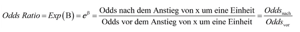{width="55%" fig-align="center"}

> A value of **1** here means no change in relative probability.

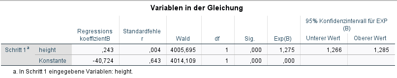{width="55%" fig-align="center"}

### Interpreting the SPSS output (Exercise 1.2)

First, SPSS produces a **"Case Processing Summary"**. Here you can check how many cases were processed or excluded.

Under **"Block 0: Beginning Block"**, SPSS creates a model without the variable `bmi`; instead, only the mode (the most frequent value) is used for the estimate. This model only serves as a point of comparison and can be ignored for now.

Under **"Block 1: Method = Enter"** you will find the following table:

### Omnibus Tests of Model Coefficients

| | Chi-square | df | Sig. |
|---|---|---|---|
| **Step 1 – Step** | 426.935 | 1 | < .001 |
| **Block** | 426.935 | 1 | < .001 |
| **Model** | 426.935 | 1 | < .001 |

The **Omnibus test** is a Chi² test that compares the "explanatory power" of the model you formulated (with `bmi`) to the "null model" from Block 0. You can ignore "Step" and "Block" here. If **Sig. is below 0.05**, the new model differs significantly from the "null model".

Under **"Model Summary"** you will find information about the model fit. For logistic regression, analogues to the R² of linear regression are used for this purpose. There is a large number of different such **pseudo-R²** measures; two of them are implemented in SPSS: the **Cox and Snell R²** and the **Nagelkerke R²**.

The **"Classification Table"** shows the predicted probabilities against the observed values: SPSS uses a probability of **50%** as the cutoff to decide whether the observed subject has a predicted periodontitis (y = 1). This threshold can be changed. The result can be read from the table.

Under **"Variables in the Equation"** you will find the variables with their corresponding coefficients — see the example above.

### Interaction terms and effect modification

So far, we have assumed that the underlying effect of our (primary) predictor is the same across the levels of the individual covariates. This is not always the case, however.

With **effect modification**, the association between risk factor and outcome is not constant across the different levels of the covariate — i.e., the covariate changes the effect of the risk factor.

**Graphically:** if the relationship between risk factor and outcome remains unchanged across different levels of the covariate, there is **no effect modification**.

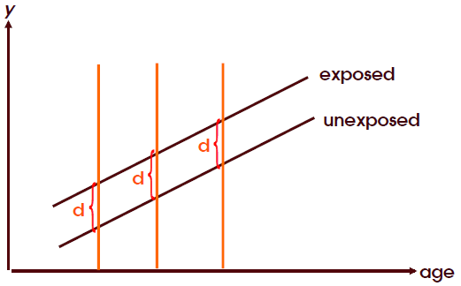{width="55%" fig-align="center"}

If an **interaction** is present, the association between the risk factor and the outcome variable is not constant across the different levels of the covariate.

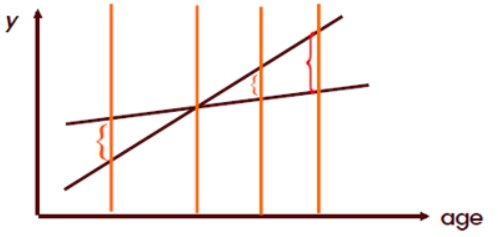{width="55%" fig-align="center"}

To determine whether the covariate is an effect modifier, you build a model with an **interaction term** ("variable a" × "variable b"). The variable is only considered an effect modifier if:

a) The interaction is biologically plausible
b) The interaction term is statistically significant

::::

:::: {.content-visible when-profile="german"}
## Cheatsheet – Logistische Regression

Cheatsheet anzeigen

### Einführung

Die **(binär) logistische Regression** wird angewandt, wenn ein Zusammenhang zwischen einer abhängigen binären und einer oder mehreren unabhängigen Variablen untersucht werden soll.

Im Unterschied zur linearen Regression ist die abhängige Variable jedoch **binär** (Herzinfarkt: ja oder nein, Zahn vorhanden: ja oder nein). Die unabhängigen Variablen sind hingegen min. intervallskaliert oder als Dummy-Variablen codiert.

Die binär logistische Regressionsanalyse untersucht den Zusammenhang zwischen der Wahrscheinlichkeit, dass die abhängige Variable den Wert 1 annimmt und den unabhängigen Variablen. Es wird also nicht der Wert der unabhängigen Variable vorausgesagt, sondern die **Wahrscheinlichkeit**, dass die Variable den Wert 1 annimmt.

### Voraussetzungen

Die Voraussetzungen sind weniger restriktiv als bei der linearen Regression:

-   Die unabhängige Variable ist binär (0 / 1 – codiert)
-   Die unabhängigen Variablen sind metrisch oder im Falle kategorialer Variablen als Dummy-Variablen codiert
-   Die Gruppen der kategorialen Prädiktoren sind ausreichend groß
-   Die unabhängigen Variablen sind untereinander nicht hoch korreliert (Multikollinearität)

Die Methode ist im Gegensatz zur linearen Regression nicht die „least-squares method" sondern die **„Maximum likelihood"** Methode.

### Darstellung (S-Kurve)

Darstellung in sehr abgekürzter Form (Blau = beobachtet 1, rot = beobachtet 0):

{width="45%" fig-align="center"}

Wir benutzen die beobachteten Werte um die vorhergesagten Wahrscheinlichkeiten unserer S-Kurve zu berechnen. Blau (= 1) soll unser Modell mit einer möglichst hohen Wahrscheinlichkeit vorhersagen. Unser Modell sagt die Wahrscheinlichkeit für 1 vorher. Die Wahrscheinlichkeit für Rot (= nicht 1) ist dementsprechend (1 – Wahrscheinlichkeit für blau). Auch hier soll unser Modell möglichst exakt vorhersagen, ob 1 nicht eintritt. Die Maximum Likelihood berechnet sich anhand der einzelnen Wahrscheinlichkeiten:

{width="60%" fig-align="center"}

SPSS führt diese Berechnungen mithilfe eines Algorithmus mehrfach aus und wählt die S-Kurve mit der höchsten Wahrscheinlichkeit.

### Interpretation der Regressionskoeffizienten

Die Regressionskoeffizienten der logistischen Regression lassen sich nicht mehr gleich interpretieren, wie das bei der linearen Regression der Fall war. Allerdings ist die Interpretation eines Vorzeichens nach wie vor möglich. Ein positiver Regressionskoeffizient besagt, dass ein Anstieg der unabhängigen Variable mit einem Anstieg der Wahrscheinlichkeit für „Unabhängige Variable" = 1 einhergeht.

Zur genaueren Interpretation werden die **„Odds Ratios"** verwendet. SPSS bezeichnet die Odds Ratio einer Variable als **„Exp(B)"**:

{width="55%" fig-align="center"}

> Eine **1** bedeutet hier keine Veränderung der relativen Wahrscheinlichkeit.

{width="55%" fig-align="center"}

### SPSS-Output interpretieren (Aufgabe 1.2)

Zunächst erstellt SPSS eine **„Zusammenfassung der Fallverarbeitung"**. Hier lässt sich überprüfen, wie viele Fälle bearbeitet oder ausgeschlossen wurden.

Unter **„Block-0-Anfangsblock"** erstellt SPSS ein Modell ohne die Variable „bmi", stattdessen wird für die Schätzung lediglich der Modalwert (am häufigsten vorkommende Wert) verwendet. Dieses Modell dient lediglich als Vergleichsobjekt und kann zunächst ignoriert werden.

Unter **„Block-1: Methode Einschluss"** finden Sie nun folgende Tabelle:

### Omnibus-Tests der Modellkoeffizienten

| | Chi-Quadrat | df | Sig. |
|---|---|---|---|
| **Schritt 1 – Schritt** | 426,935 | 1 | < ,001 |
| **Block** | 426,935 | 1 | < ,001 |
| **Modell** | 426,935 | 1 | < ,001 |

Der **Omnibus-Test** ist ein Chi²-Test, bei dem die „Aussagekraft" des von Ihnen formulierten Modells (mit „bmi") mit dem „Nullmodell" aus Block-0 verglichen wird. „Schritt" und „Block" können Sie hierbei ignorieren. Ist der Wert **Sig. unter 0,05**, unterscheidet sich das neue Modell signifikant vom „Nullmodell".

Unter **„Modellzusammenfassung"** finden Sie Angaben zur Modellgüte. Dazu werden für die logistische Regression Analogien zum R² der linearen Regression verwendet. Es gibt eine große Anzahl verschiedener solcher **Pseudo-R²**, zwei davon sind in SPSS implementiert: das **Cox und Snell R²** und das **Nagelkerke R²**.

Die **„Klassifizierungstabelle"** – Vorhergesagte Wahrscheinlichkeiten und beobachtete Werte: SPSS nutzt die Wahrscheinlichkeit von **50 %** als Trennwert um festzulegen, ob der beobachtete Proband eine vorhergesagte Parodontitis (y = 1) hat. Der Schwellenwert kann verändert werden. Das Ergebnis kann der Tabelle entnommen werden.

Unter **„Variablen in der Gleichung"** sind die Variablen mit entsprechenden Koeffizienten aufgeführt – siehe das Beispiel oben.

### Interaktionsterme und Effektmodifikation

Bislang sind wir davon ausgegangen, dass der zugrundeliegende Effekt unseres (primären) Prädiktors zwischen den Leveln der einzelnen Kovariaten gleich ist. Das muss allerdings nicht immer wahr sein.

Bei einer **Effektmodifikation** ist die Assoziation zwischen Risikofaktor und Outcome nicht konstant in den einzelnen Leveln der Kovariate. D.h. die Kovariate verändert den Effekt des Risikofaktors.

**Grafisch betrachtet:** Wenn die Beziehung zwischen Risikofaktor und Outcome unverändert über verschiedene Level der Kovariate ist, dann liegt **keine Effektmodifikation** vor.

{width="55%" fig-align="center"}

Wenn eine **Interaktion** vorliegt, ist die Assoziation zwischen Risikofaktor und der Outcome-Variable nicht konstant bei unterschiedlichen Leveln der Kovariate.

{width="55%" fig-align="center"}

Um festzustellen, ob die Kovariate ein Effektmodifikator ist, erstellt man ein Modell mit einem **Interaktionsterm** („Variable a" × „Variable b"). Die Variable ist nur dann ein Effektmodifikator, wenn:

a) Die Interaktion biologisch plausibel ist
b) Der Interaktionsterm statistisch signifikant ist

::::