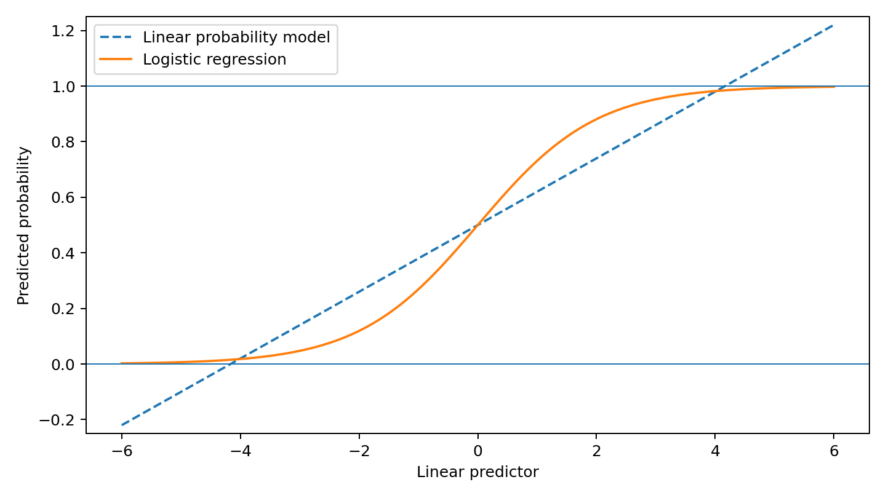
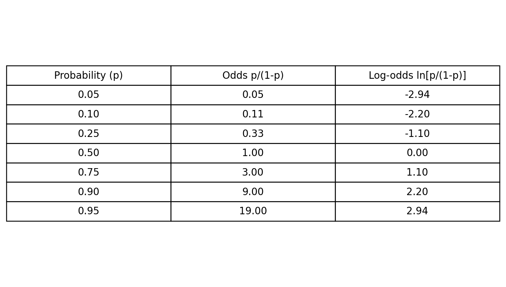
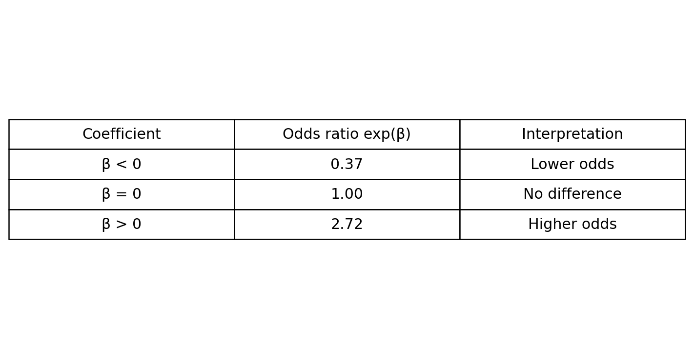
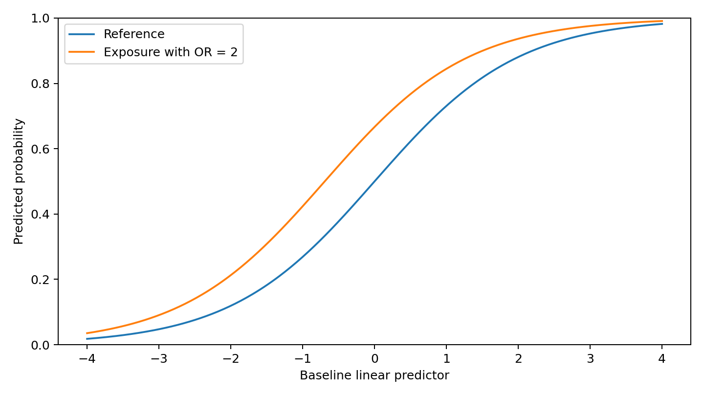
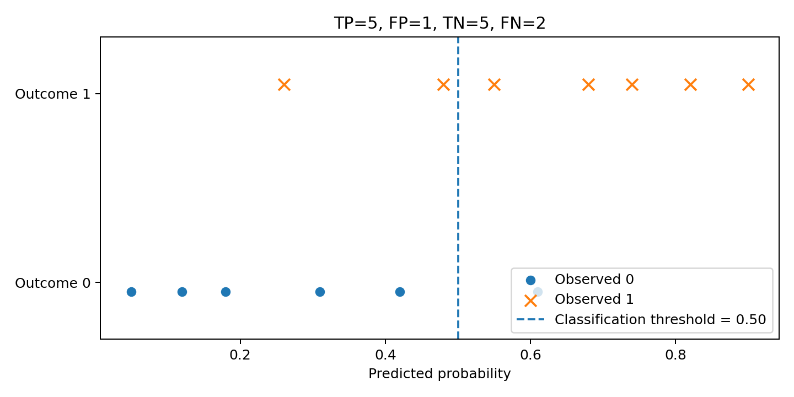
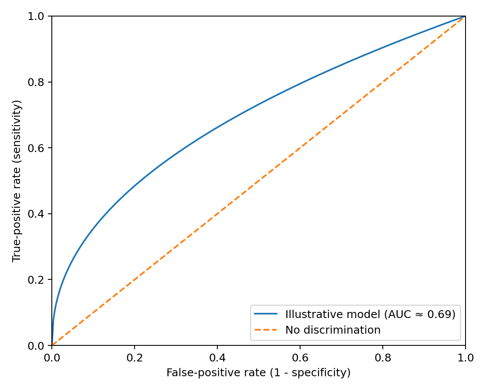

# Logistic Regression

## A 10-minute recap after linear regression

**Learning goal:** understand why logistic regression is used for binary outcomes and how to interpret its coefficients.

<!--
Timing: 30-45 seconds.
Connect explicitly to the previous class: the right-hand side of the model will still look familiar from linear regression.
-->

---

# 1. Why not use linear regression?

For a binary outcome, \(Y \in \{0,1\}\), a linear model can create problems:

- fitted values may be below 0 or above 1;
- residuals are not normally distributed;
- variance is not constant;
- classification may be unstable.

<!--
Timing: 1 minute.
Emphasise that the problem is not that linear regression can never be fitted, but that it does not naturally respect the probability scale.
-->

---

# 2. The bridge: probability, odds and log-odds

\[
\text{Odds} = \frac{p}{1-p},
\qquad
\text{Log-odds} = \log\left(\frac{p}{1-p}\right)
\]

- Probability is restricted to \([0,1]\).
- Odds range from \(0\) to \(\infty\).
- Log-odds range from \(-\infty\) to \(+\infty\).

<!--
Timing: 1.5 minutes.
Use p=0.50 as the anchor: odds=1 and log-odds=0.
-->

---

# 3. The logistic regression model

\[
\log\left(\frac{p}{1-p}\right)
=
\beta_0 + \beta_1x_1 + \cdots + \beta_kx_k
\]

This is a **generalised linear model**:

- the outcome follows a binomial distribution;
- the **logit** is the link function;
- the right-hand side is the same linear predictor used in multiple linear regression.

The inverse transformation returns a probability:

\[
p = \frac{\exp(\eta)}{1+\exp(\eta)},
\qquad
\eta = \beta_0 + \beta_1x_1 + \cdots + \beta_kx_k
\]

<!--
Timing: 1.5 minutes.
Key message: the model is linear on the log-odds scale, not on the probability scale.
-->

---

# 4. Interpreting coefficients

A coefficient \(\beta_j\) is the change in **log-odds** for a one-unit increase in \(x_j\), holding the other variables constant.

Exponentiating gives an odds ratio:

\[
OR_j = \exp(\beta_j)
\]

**Example:** \(OR=1.30\) means 30% higher odds, not necessarily a 30% higher probability.

<!--
Timing: 1.5 minutes.
For categorical predictors, interpret the OR relative to the reference category.
-->

---

# 5. Odds ratios are not risk ratios

The same odds ratio can correspond to different changes in probability, depending on the baseline probability.

Therefore, when possible, complement odds ratios with:

- predicted probabilities;
- marginal effects;
- absolute risk differences.

<!--
Timing: 1 minute.
This slide prevents the common error of reading an OR as a direct percentage change in risk.
-->

---

# 6. Estimation and uncertainty

Unlike ordinary linear regression, logistic regression is not estimated by least squares.

- Parameters are estimated using **maximum likelihood**.
- A 95% confidence interval for a coefficient is approximately:

\[
\beta_j \pm 1.96\,SE(\beta_j)
\]

- Transform both limits with \(\exp(\cdot)\) to obtain the confidence interval for the odds ratio.
- The odds-ratio confidence interval is generally asymmetric.

<!--
Timing: 1 minute.
You do not need to derive the likelihood in a recap; focus on what changes from linear regression.
-->

---

# 7. Prediction and classification are different tasks

Logistic regression first predicts a **probability**. A binary classification requires a threshold.

Changing the threshold changes:

- sensitivity;
- specificity;
- false positives;
- false negatives.

<!--
Timing: 1 minute.
Stress that 0.50 is conventional, not universally optimal.
-->

---

# 8. Model performance and assumptions

**For prediction**

- ROC curve and AUC assess discrimination.
- Calibration assesses agreement between predicted and observed risks.
- AIC or likelihood-ratio tests can compare suitable models.

**Key assumptions and requirements**

- independent observations, unless dependence is modelled;
- linearity between continuous predictors and the **logit**;
- no severe multicollinearity;
- adequate sample size and enough outcome events;
- correct model specification.

<!--
Timing: 1 minute.
Mention that pseudo-R² does not have the same interpretation as R² in linear regression.
-->

---

# Take-home messages

1. Logistic regression is designed for binary outcomes.
2. It models a linear relationship on the **log-odds** scale.
3. Exponentiated coefficients are **odds ratios**.
4. Odds ratios should not automatically be interpreted as risk ratios.
5. Predicted probabilities are often easier to communicate.
6. Model evaluation depends on the goal: explanation, causal inference or prediction.

<!--
Timing: 30-45 seconds.
Close by asking students to explain, in one sentence, why fitted probabilities from logistic regression remain between 0 and 1.
-->
